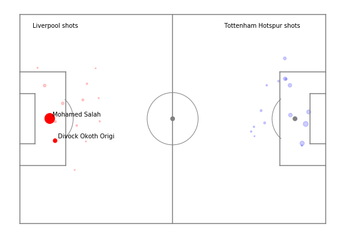
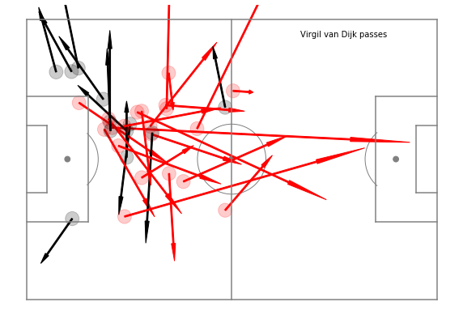
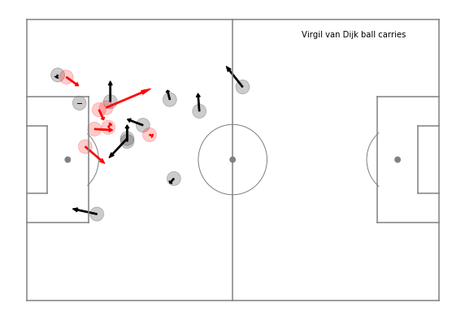

# StatsBomb | Analysing the UCL 2018/19 Final Data

StatsBomb data can be found **<a href="https://github.com/statsbomb/open-data">HERE</a>**

The 2018/19 UEFA Champions League final was played at the Metropolitano Stadium, between Tottenham Hotspur (in their first European Cup final), and Liverpool (in their ninth European Cup final and their second in a row), having been defeated by Real Madrid in 2018 which I will not be mentioning again. Like last time, the help of Friends of Trackings allowed me to create graphics from the competition and player I like.

Once the StatsBomb data had been loaded in, I began on plotting a xG shot map. This can show us the location and likelihood that an attempt on goal will result in a goal, based on a wealth of historical evidence from past matches provided by StatsBomb. The results tell me that Liverpool capitalised on their two best chances in the game, whereas Spurs failed too, although it looks like they have three or four decent opportunities in the 'Golden Zone'.

Moving onto player analysis, I wanted to take a look at the Man of the Match, Virgil van Dijk. The main objective for van Dijk as part of this Liverpool team is to prevent the opposition form creating high-value goal scoring chances. However, Liverpool are a side that want to dominate the ball and play on the front foot, and  s a result of this the central defenders in this team have to be able to use the ball effectively as they have space and time in possession when in the attacking phase.

Van Dijk is a very impressive distributor of the ball, he can distribute to all areas of the pitch with good accuracy. He is also constantly looking for opportunities to pass vertically and help his team to progress into the opposition half. Below shows every pass van Dijk made in the final, with the red arrows indicating forward passes and the black arrow sideways or backwards.

As well as being a solid distributor, van Dijk also possesses a threat to the opposition when stepping out from the defensive line in possession of the ball. Having central defenders who are capable of carrying the ball forward in possession is extremely effective as it forces opposition players to break their defensive block and look to engage and close the man in possession down. This will then create spaces behind that pressing player that the attacking side can take advantage of. 

The graphic below shows where van Dijk began and finsihed carrying the ball throughout the match. First glance, I would suspect these positions are fairly deep compaired to average, although, Liverpool only having 39% of the ball this game may be a good reason why.

# What I Learnt

- Identifying specific matches in Statsbomb data
- Finding all the shots in match data.
- Plotting a pitch, shots on the pitch, expected goals, passes and carries.
